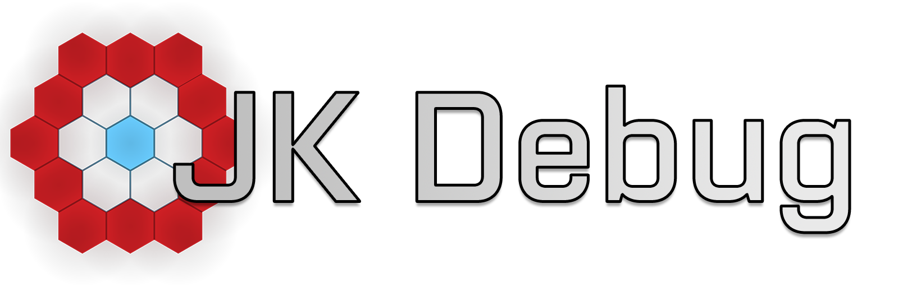

## ArmA Debugging Extension

## English:
### Introduction
JK_debug is a small tool, however, which I wanted for a long time write times lacked until now the Mutivation.
But now I have finished and post them with here.

### Features
 - Variables from all data types Read on which may be variable (currently: namespaces, objects, tasks, Controll, team member, Groups, Locations ").
 - Threads read currently running
 - Variable Filter

### Roadmap
 - Read UINamespace and profiles namespace in multiplayer
 - Update Variables from the tool
 - out filters massive newline by Macros
 - Cleanup Code
 - Release Source

## German:
### Einleitung
JK_debug ist ein kleines Tool welches ich schon seit langer zeit mal schreiben wollte jedoch fehlte mir bis jetzt die Mutivation.
Nun jedoch habe ich sie fertig gestellt und veröffentliche sie hier mit.

### Features
 - Variablen aus allen DatenTypen lesen auf dennen Variablen liegen kann (aktuell: Namespaces, Objects, Tasks, Controll, teamMember, Groups, Locations").
 - Threads auslesen die aktuell laufen
 - Variablen Filtern

### Roadmap
 - UINamespace und ProfileNamespace im Mulitplayer auslesen
 - Variablen aus dem Tool heraus updaten
 - Massive newline durch Macros raus Filtern
 - Cleanup Code
 - Release Source

### Screenshots

### Download
[Download Hier](https://github.com/jokoho48/JK_Debug/releases)

### Issue Tracker
[Klick hier](https://github.com/jokoho48/JK_Debug/issues)
